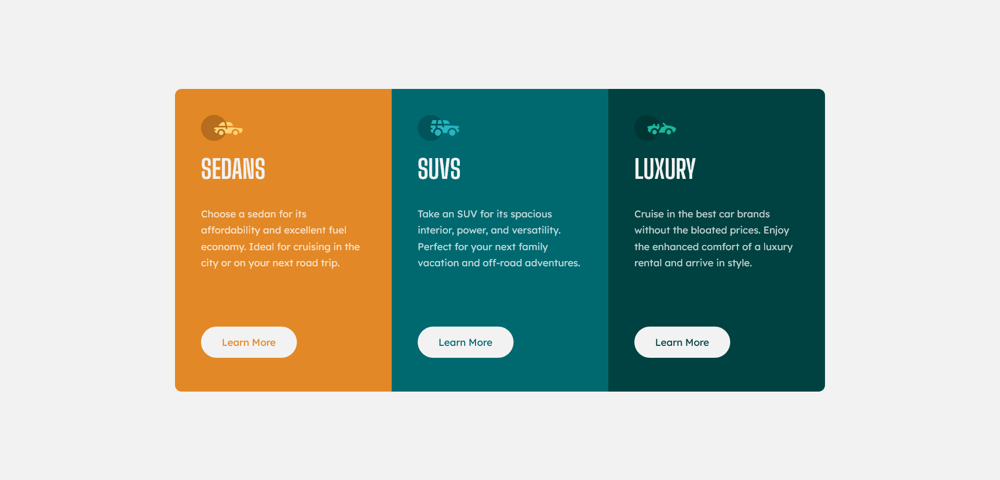

# Frontend Mentor - 3-column preview card component solution

This is a solution to the [3-column preview card component challenge on Frontend Mentor](https://www.frontendmentor.io/challenges/3column-preview-card-component-pH92eAR2-). Frontend Mentor challenges help you improve your coding skills by building realistic projects.

## Table of contents

- [Overview](#overview)
  - [The challenge](#the-challenge)
  - [Screenshot](#screenshot)
  - [Links](#links)
- [My process](#my-process)
  - [Built with](#built-with)
 - [Continued development](#continued-development)
  - [Useful resources](#useful-resources)
- [Author](#author)
- [Acknowledgments](#acknowledgments)

## Overview

### The challenge

Users should be able to:

- View the optimal layout depending on their device's screen size
- See hover states for interactive elements

### Screenshot

### Links

- Solution URL: [Add solution URL here](https://your-solution-url.com)
- Live Site URL: [Add live site URL here](https://your-live-site-url.com)

## My process

### Built with

- Semantic HTML5 markup
- CSS custom properties
- Flexbox
### Continued development

I will consider to start using a CSS preprocessor I am sure that will facilitate lot of tasks.

### Useful resources

- [Youtube](https://www.youtube.com) - Youtube is a very hellpful recources for all developers, I mean you just need to tape your bug or where did you have an issue and a ton of tutorials will appear.
-  [Stackoverflow](https://stackoverflow.com/) - This is the place where almost all the developers of the word meet, lot of them have experiences and are willing to help but also lot of them are just looking for help, So it's a great community and great resource for sure.
## Author

- Website - [Njoura7](https://github.com/Njoura7)
- Frontend Mentor - [@Njoura7](https://www.frontendmentor.io/profile/Njoura7)

## Acknowledgments
Those are my heros heroes that I am following right now and who are helping me in almost every single step and project:

### Youtube channels:
[*Kevin Powell*](https://www.youtube.com/kepowob)

[*Web Dev Simplified*](https://www.youtube.com/c/WebDevSimplified)

[*Traversy Media* ](https://www.youtube.com/c/TraversyMedia)

[*Dave Gray*](https://www.youtube.com/c/DaveGrayTeachesCode)